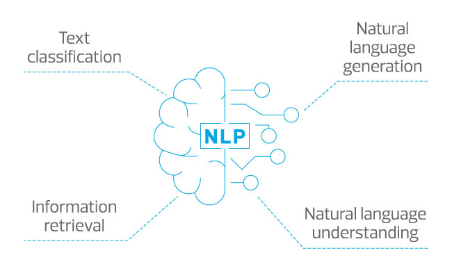
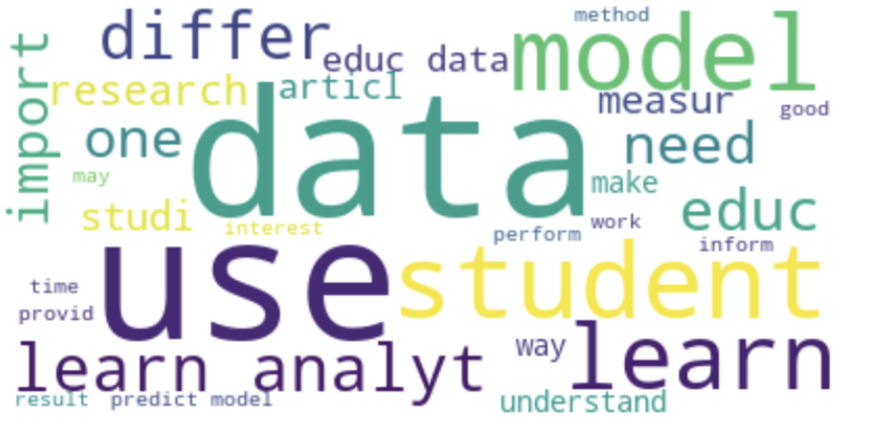
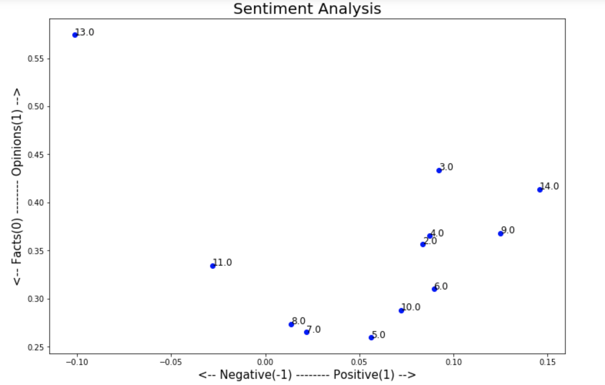
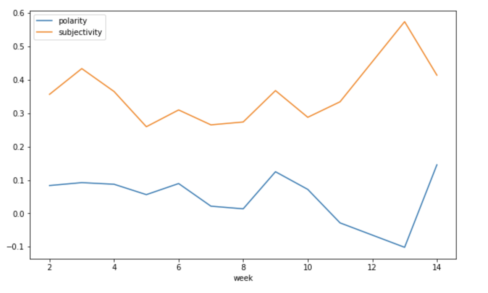
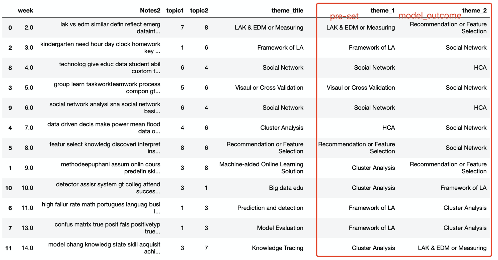

# Natural Language Processing
 
The use of natural language processing has exploded over the last decade. Appilcations that require machines to understand natural human speech patterns are abundant and substantial improvements in these systems has increased their utility. Within the educational space NLP is used to interpret human speech for the prupose of understanding human problems and recently an online tutor passed a limited version of the [Turing Test](https://en.wikipedia.org/wiki/Turing_test) when it was [indistinguishable from teaching assistants in a college class](http://www.news.gatech.edu/2017/01/09/jill-watson-round-three).

## Goals for this unit

* Understand and apply the basic process of natural language proceessing and the role of pre-processing text
* Understand and apply a sentiment analysis to a set of documents
* Understand and apply a latent dirichlet allocation (LDA) to a set of documents

# Pacakge used in Python
`pandas`: data cleaning and wrangling  
`matplotlib`: plotting  
`re` : Regular Expression  
`os` : Handle list of documents  
`nltk.corpus`: import corpus: stopwords  
`wordcloud.WordCloud` : wordcloud  
`textblob.TextBlob` : Sentiment analysis  
`sklearn.feature_extraction.text.CountVectorizer` :Tokenization 
`sklearn.decomposition.LatentDirichletAllocation` :LDA 

## Tasks for this unit

In this project we have completed three main tasks. Processing a set of documents, running a sentiment analysis of thise documents and then generating topic models of those documents. The documents we were using are student notes that the class HUDK4050 made 2019 fall semester. As background to this task please read over the follwing materials and watch the methodological videos. 

## Result

From the wordcloud, we could quickly capture the core heart of HUDK 4050: Data, Educatoin, Model and Analysis 
 

-By week, most of the weekly sentiments are slightly positive and more inclined to be fact than opinion, from which ,we could assume that students were rephrasing the content in the notes instead of building up their own understanding and own opinionated perspectives. **This suggests that teachers could encourage students to be more of an active reader by putting in more of their thoughts based on the reading in the following semsters**/.   There are two outlier weeks, which are week 11 and week 13 with theme of Prediction and Detection, and Model evaluation respectively. The sentiments of the notes in these two weeks score slightly below zero regarding positivity, **probably indicating some hardship doing prediction and detection and model evaluation in educational setting**. However, the sentiment is so weak that we shall not pay too much attention to that. 
 

-The polarity remains constant close to the neutral line, slightly positive in the comments except for week 13. This week, Model evaluation, students have a lot of emotion to express in their notes, to some extent, slightly negative.  -In most of the week, the two lines, polarity and subjectivity rise and drop parallelly. Nontheless, starting from week 10, lines went in oppositie direction--- sujectivity went up and down later, while polarity went down first and then up.  This tells us that starting from week either the time factor or the themes or both affect the fluctuation of the sentiment.In week 13, the sujectivity has reached the peak whereas polarity declined to the lowest point. This reinforce the statement above that week 13 is sucjectively negative. **Students's expecation about prospect of learning analytics has been discouraged or disappointed by the hardship in the real world application--prediction, feature selection and model evaluation**. 
 

-After trying several numbers of topic in the LDA model, we have concluded that **8** is the optimal number for modeling these weekly notes.  - The comaprsion table also gives us a constrasting view of how the notes reflect the weekly themes. The result is quite promising, **7 out of the 12** pre-set themes are 100% matched with the model outcome. The rest of the themes (5) <ins>although are not matched perfectly, the assigned outcome could still be valid due to the overlapped content and dicusssion direction.</ins>

## Readings

* [Nadkarni, P. M., Ohno-Machado, L., & Chapman, W. W. (2011). Natural language processing: An Introduction. Journal of the American Medical Informatics Association: JAMIA, 18(5), 544–551.](http://www.ncbi.nlm.nih.gov/pmc/articles/PMC3168328/)

* [Robinson, A. C. (2015). Exploring Class Discussions from a Massive Open Online Course (MOOC) on Cartography. In J. Brus, A. Vondrakova, & V. Vozenilek (Eds.), Modern Trends in Cartography (pp. 173–182). Springer International Publishing.](http://link.springer.com.ezproxy.cul.columbia.edu/chapter/10.1007/978-3-319-07926-4_14)

* [McNamara, D. S., Crossley, S. A., & Roscoe, R. (2013). Natural Language Processing in an Intelligent Writing Strategy Tutoring System. Behavior Research Methods, 45(2), 499–515.](http://link.springer.com.ezproxy.cul.columbia.edu/article/10.3758/s13428-012-0258-1)

## Videos

[Crash Course. (2017). Natural Language Processing.](https://www.youtube.com/watch?v=fOvTtapxa9c)

[Raval, S. (2016). Sentiment Analysis in 4 Minutes.](https://www.youtube.com/watch?v=AJVP96tAWxw)

[Knispelis, A. (2016). LDA Topic Models.](https://www.youtube.com/watch?v=3mHy4OSyRf0)

## Reference Github
[nlp-in-python-tutorial](https://github.com/zz2641/nlp-in-python-tutorial/settings)

## Additional Materials

[Quora. (2017). What is a good explanation of Latent Dirichlet Allocation?](https://www.quora.com/What-is-a-good-explanation-of-Latent-Dirichlet-Allocation)
